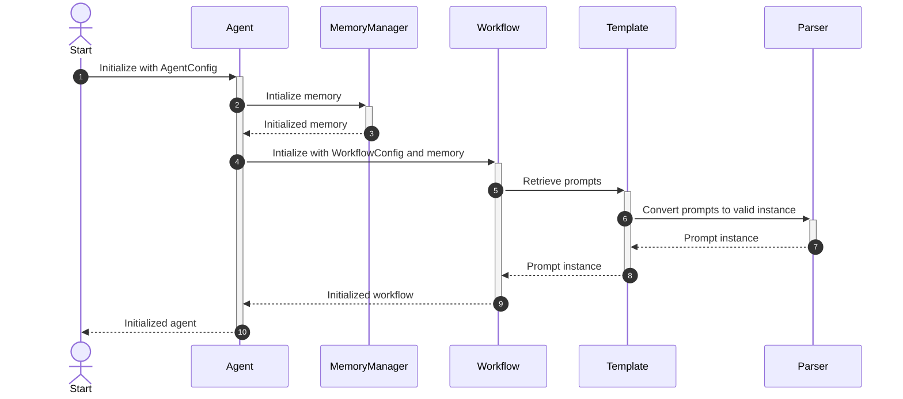
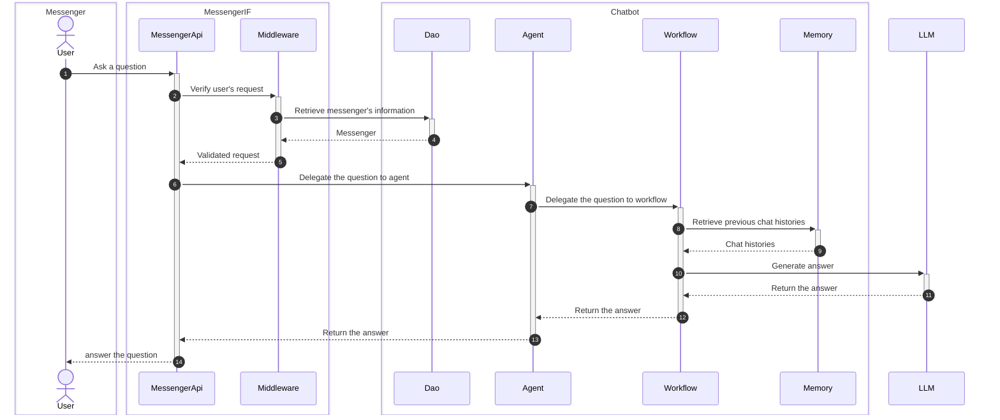

# Design(Current)
The project's architecture refers to **Domain Driven Design**.

## Ubiquitous Language
| Concept   | Description                                                 |
| --------- | ----------------------------------------------------------- |
| Chatbot   | Service to answer various questions in the given time limit |
| Messenger | Text-based communication channel                            |
| User      | Messenger's user                                            |
| Memory    | Chat histories between a chatbot and an user                |
| Workflow  | Chatbot's senario                                           |
| Template  | LLM's prompt template                                       |

## Senario
### Initialize chatbot

### User ask a question

## Project Structure

- `src/llm_chatbot_for_messengers/`
    - `core/`: Core models package
        - `entity/`: Entities package
            - `agent`: Represent chatbot
            - `messenger`: Represent messengers
            - `user`: Represent messenger's users
        - `output/`: Outbound services package
            - `dao`: Manage persistances
            - `memory`: Manage agent's memory
            - `parser`: Convert LLM prompt template file to object
            - `template`: Manage LLM prompt template store
        - `workflow/`: Chatbot's workflow
            - `base`: Abstract workflow
            - `qa`: QA Workflow
            - `vo`: Workflow's Value objects
        - `configuration`: Chatbot's configuration
        - `error`: Core package's errors
        - `specificatgion`: Constraints of entites and vos
        - `vo`: Value objects of Entities
    - `messengers/`: Messenger's custom chatbot IF package
        - `kakao/`: Kakao custom chatbot IF
        - `middleware/`: Common middlewares
        - `vo`: Common Value objects
    - `main`: Project's entrypoint.
