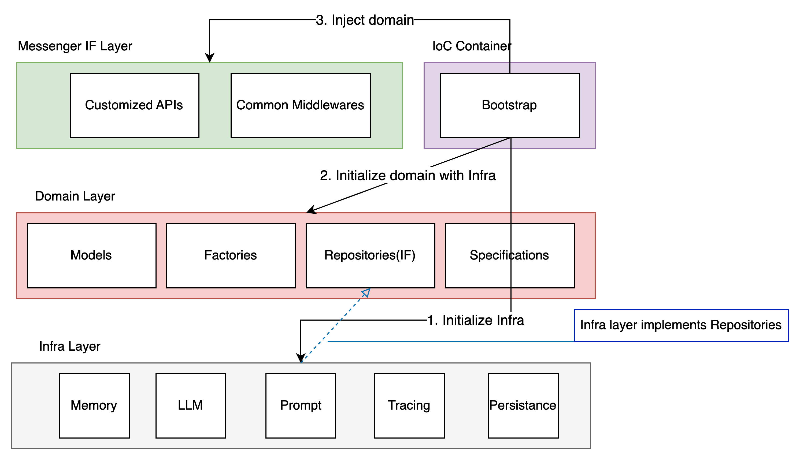

# Design(Future)
The project's architecture refers to **Domain Driven Design**.

## Ubiquitous Language
| Concept   | Description                                                 |
| --------- | ----------------------------------------------------------- |
| Chatbot   | Service to answer various questions in the given time limit |
| Messenger | Text-based communication channel                            |
| User      | Messenger's user                                            |
| Memory    | Chat histories between a chatbot and an user                |
| Workflow  | Chatbot's senario                                           |
| Prompt    | LLM's prompt (template)                                     |

## Architecture

## Domain
### Models(Aggregate)
#### Chatbot
| Name     | Type        | Goal                    | Description                         |
| -------- | ----------- | ----------------------- | ----------------------------------- |
| Chatbot  | Root Entity | Ask questions in time   | Manage its workflow and memory      |
| Workflow | VO          | Configure senarios      | Set Memories and prompts to use LLM |
| Memory   | VO          | Store chat histories    | Manage session's communications     |
| Prompt   | Entity      | Configure LLM's prompts | Set workflow's detail prompts       |

#### Messenger
| Name      | Type        | Goal                    | Description                                     |
| --------- | ----------- | ----------------------- | ----------------------------------------------- |
| Messenger | Root Entity | Manage valid messengers | Manage its users                                |
| User      | Entity      | Messenger's user        | This project doesn't manage users independently |

#### Tracing
| Name    | Type    | Goal               | Description |
| ------- | ------- | ------------------ | ----------- |
| Tracing | Root VO | Manage traced data | -           |

#### Service
| Name             | Models           | Goal                           | Description |
| ---------------- | ---------------- | ------------------------------ | ----------- |
| ChatService      | Chatbot, Tracing | Chat with users and store data | -           |
| MessengerService | Messenger        | Manage messengers and users    | -           |

### Factory
| Name           | Models  | Goal                                      | Description |
| -------------- | ------- | ----------------------------------------- | ----------- |
| ChatbotFactory | Chatbot | Create a chatbot based on a specification | -           |
| TracingFactory | Tracing | Create a tracing based on a specification | -           |

### Repository
| Name                | Models    | Goal                            | Description |
| ------------------- | --------- | ------------------------------- | ----------- |
| ChatbotRepository   | Chatbot   | Manage chatbot's persistances   | -           |
| MessengerRepository | Messenger | Manage messenger's persistances | -           |
| TracingRepository   | Tracing   | Manage Tracing's persistances   | -           |

### Specification
Each `Factory` and `Repository` use their specifications to access valid models
