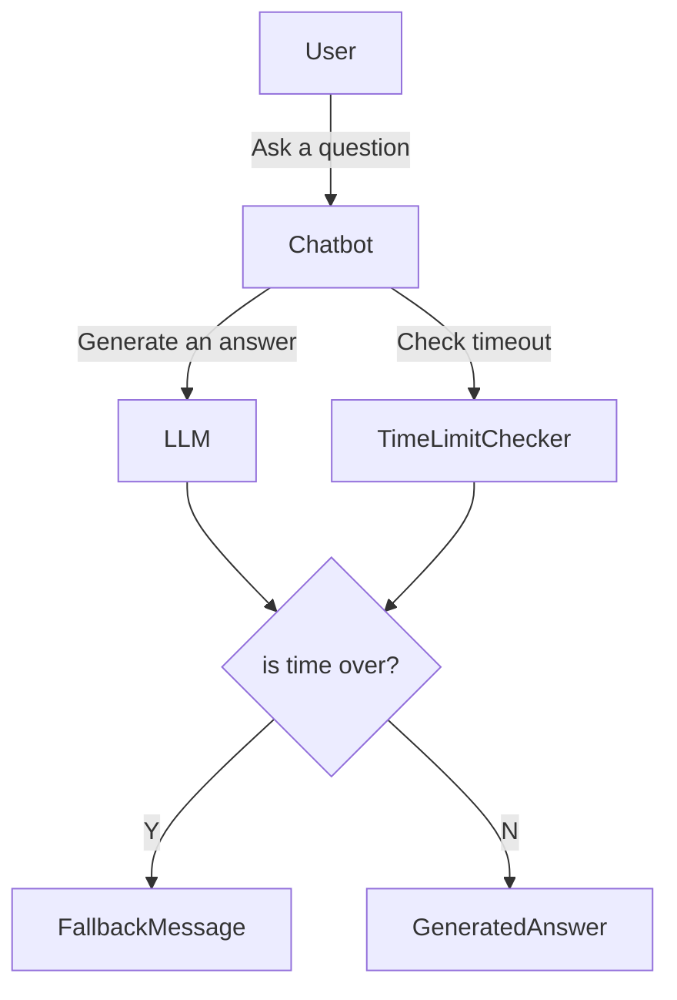

# LLM Chatbot for messengers
Time bound chatbot for various messengers.

---

## Overview
This project aims to solve the time-bound issue that arises when integrating LLM-based chatbots with messenger platforms. 
While LLM chatbots enable more natural and conversational interactions, they often require more time to generate responses for complex scenarios. 
Some messengers enforce strict response time limits for third-party chatbots, and if these limits are exceeded, responses are forcibly rejected. 
As a result, users may not receive chatbot replies, even if the chatbot generates them successfully.  
This project addresses this challenge by providing a solution that ensures timely responses, enabling smoother integration of LLM chatbots with messenger platforms. 
By using this project, developers can create LLM-based chatbots that comply with messenger time constraints more effectively.

## Main Senario

